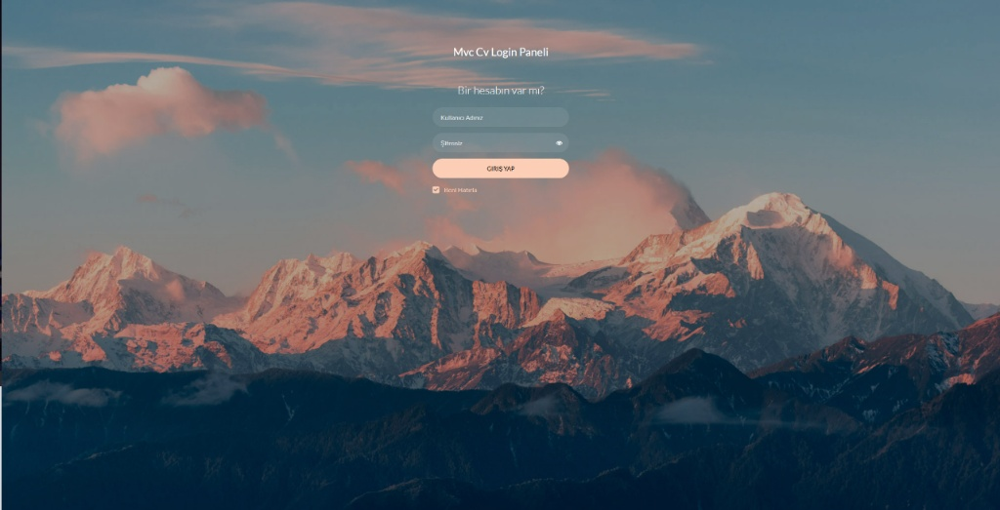
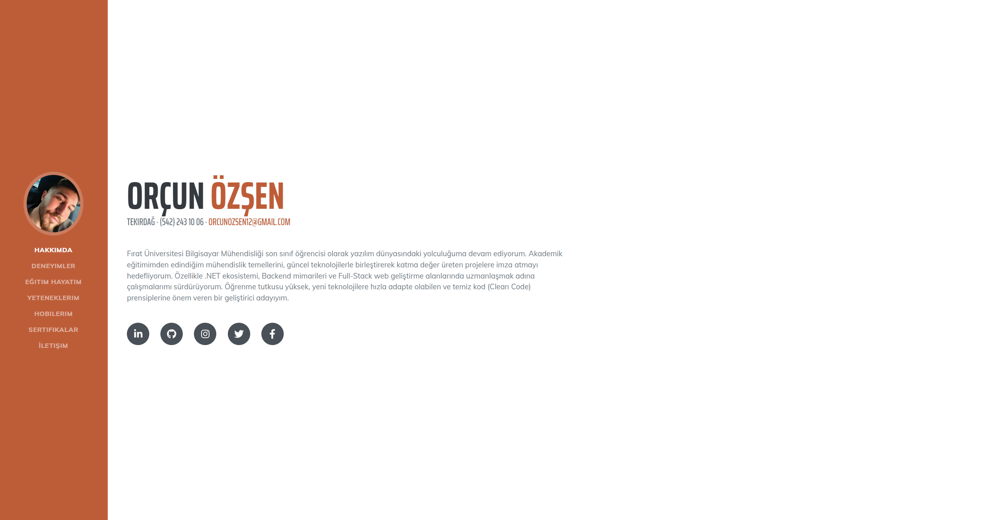
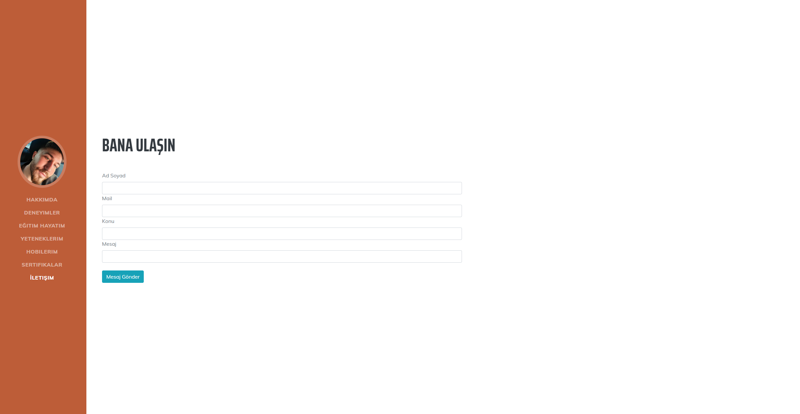
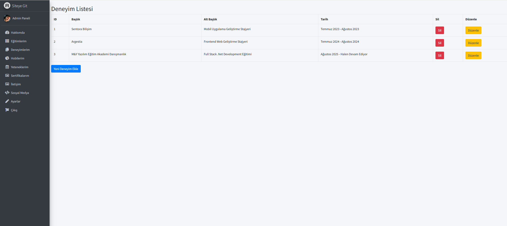

# MvcCv - Dinamik Kişisel Web Sitesi ve Yönetim Paneli

Bu proje, ASP.NET MVC mimarisi kullanılarak geliştirilmiş, dinamik içerik yönetimine sahip bir kişisel CV ve portfolyo web sitesidir. Site üzerindeki tüm içerikler (Hakkımda, Deneyimler, Eğitim, Yetenekler vb.) geliştirilen Admin Paneli üzerinden kod bilgisi gerektirmeden yönetilebilir.

## 🚀 Proje Özellikleri

* **Admin Paneli:** Site sahibinin içerikleri yönetebilmesi için güvenli bir yönetim arayüzü.
* **Dinamik İçerik:** Eğitim, Deneyim, Sertifikalar ve Yetenekler bölümleri veritabanından dinamik olarak çekilir.
* **Güvenlik:** Admin paneli girişinde yetkilendirme (Authentication & Authorization) kontrolleri.
* **CRUD İşlemleri:** Veri Ekleme, Okuma, Güncelleme ve Silme işlemleri.
* **Responsive Tasarım:** Mobil ve masaüstü uyumlu modern arayüz (Bootstrap).

## 🛠️ Kullanılan Teknolojiler

* **Framework:** ASP.NET MVC
* **Dil:** C#
* **Veritabanı:** MS SQL Server
* **ORM:** Entity Framework (Linq)
* **Frontend:** HTML5, CSS3, Bootstrap, JavaScript
* **IDE:** Visual Studio

## 📷 Ekran Görüntüleri

| Site Görünümü | Admin Paneli |

**Site Login Sayfası:**


**Site Görünümü:**




**Admin Paneli:**


## ⚙️ Kurulum (Nasıl Çalıştırılır?)

1.  Projeyi bilgisayarınıza klonlayın:
    ```bash
    git clone [https://github.com/orcuno03/MvcCv.git](https://github.com/orcuno03/MvcCv.git)
    ```
2.  Projeyi Visual Studio ile açın.
3.  `web.config` dosyası içerisindeki veritabanı bağlantı adresini (Connection String) kendi lokal sunucunuza göre düzenleyin.
4.  Package Manager Console üzerinden veritabanını oluşturun (Code First kullanıldıysa):
    ```bash
    update-database
    ```
5.  Projeyi `Ctrl + F5` ile çalıştırın.

---
**Geliştirici:** [Orçun](https://github.com/orcuno03)
